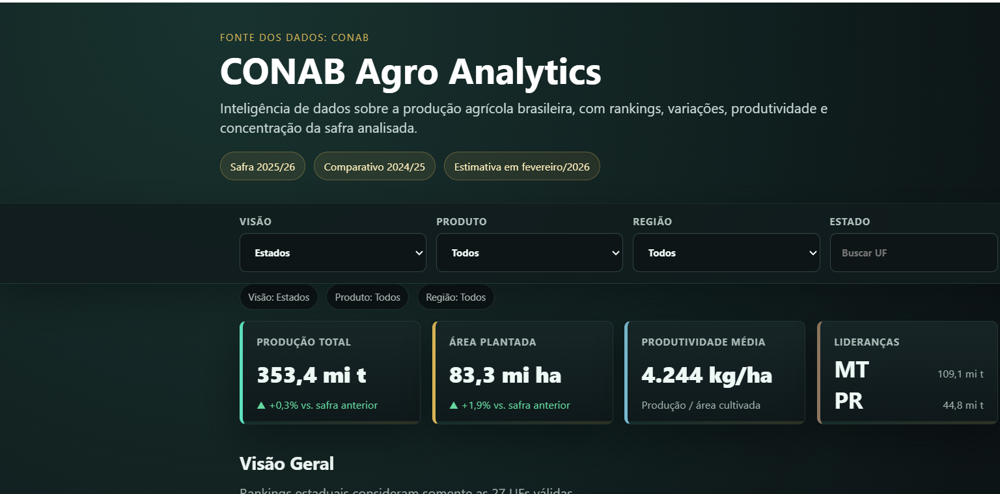

# Agroscope



Projeto de analytics com dados oficiais da CONAB para a estimativa da safra 2025/26, comparada a 2024/25. O objetivo e transformar arquivos brutos em bases auditaveis, metricas, visualizacoes, consultas SQL e um dashboard executivo estatico sobre a producao agricola brasileira.

## Destaques

- Producao total Brasil: 353,375.92 mil t.
- Area total Brasil: 83,257.90 mil ha.
- Top cultura por producao: SOJA, com 177,985.00 mil t.
- Top UF por producao: MT, com 109,088.70 mil t.
- Concentracao por produto: CR3 de 92.63%, CR5 de 96.48% e HHI de 4092.07.
- Concentracao estadual: CR3 de 54.56%, CR5 de 72.98% e HHI de 1491.96.
- Apenas 2 produtos respondem por aproximadamente 80% da producao analisada.
- Apenas 7 UFs respondem por aproximadamente 80% da producao estadual analisada.

## Perguntas de negocio

- Quais culturas e UFs concentram producao, area e produtividade?
- Quais produtos e estados cresceram ou recuaram frente a safra anterior?
- A variacao de producao esta mais associada a area, produtividade ou ambos?
- Qual e o nivel de concentracao da producao agricola no recorte analisado?

## Fonte dos dados

- Fonte oficial: CONAB, 5o levantamento da safra de graos 2025/26.
- Referencia: estimativa de fevereiro/2026.
- Comparativo: safra 2025/26 contra 2024/25.
- Dados brutos preservados em `data/raw`.
- O CSV por produto foi extraido da aba `Brasil - Total por Produto` do XLSX oficial.
- Dados por produto e localidade foram extraidos das abas especificas de cada cultura no XLSX oficial.

## Entregaveis

- Dashboard estatico: `reports/dashboard.html`.
- Resumo executivo: `reports/executive_summary.md`.
- Relatorio de qualidade: `reports/data_quality_report.md`.
- Dicionario de dados: `docs/data_dictionary.md`.
- Figuras principais em `reports/figures`.
- Bases tratadas em CSV e Parquet em `data/processed`.
- Exports analiticos em `data/exports`.
- Scripts SQL em `sql`.
- Testes automatizados em `tests`.

## Estrutura

```text
data/
  raw/          Dados originais e extraidos da CONAB
  processed/    Bases tratadas em CSV e Parquet
  exports/      Tabelas analiticas para consumo externo
docs/           Dicionario de dados e imagens
notebooks/      Analises exploratorias em Python e R
reports/        Dashboard, resumo executivo, qualidade e figuras
sql/            Schema, carga e consultas analiticas
src/
  python/       Pipeline, transformacao, metricas e visualizacao
  r/            Analise estatistica complementar
tests/          Testes de qualidade e consistencia
```

## Tecnologias

Python, Pandas, NumPy, PyArrow, Matplotlib, Plotly, SciPy, Statsmodels, Pytest, Jupyter, R, tidyverse, ggplot2 e SQL/PostgreSQL.

## Como executar

No PowerShell:

```powershell
python -m pip install -r requirements.txt
$env:MPLCONFIGDIR=".matplotlib"
python src/python/pipeline.py
python -m pytest -q
```

Depois abra `reports/dashboard.html` no navegador.

## Dashboard

O dashboard `Agroscope` e uma aplicacao HTML/CSS/JavaScript estatica gerada pelo pipeline Python. Ele apresenta uma leitura executiva da safra atual, com filtros por visao, produto, regiao e busca textual.

Versao para GitHub Pages: `docs/index.html`.
URL esperada apos ativar o Pages: `https://wwerneck.github.io/Analise-do-Agro/`.

Principais recursos:

- KPIs de producao, area, produtividade e variacao.
- Ranking de culturas e estados por producao.
- Cruzamento Produto x Regiao a partir das abas especificas da planilha oficial.
- Concentracao estadual com CR3, CR5, HHI e Pareto 80%.
- Quadrantes de area x produtividade para leitura dos drivers de variacao.
- Insights deterministicos calculados no navegador.
- Tabela detalhada e download CSV respeitando os filtros ativos.

## Metodologia

- Percentuais oficiais sao preservados e tambem recalculados em colunas separadas para auditoria.
- Rankings estaduais usam somente `tipo_linha == "uf"`, sem misturar Brasil, regioes ou agregados regionais.
- Produtos com totais e subcategorias usam regra anti-dupla-contagem: totais como `MILHO TOTAL`, `FEIJAO TOTAL`, `AMENDOIM TOTAL` e `ARROZ` entram no ranking principal; detalhamentos equivalentes ficam fora da base analitica de participacao.
- A decomposicao da variacao usa sinais de area e produtividade para classificar expansoes e quedas.
- O recorte possui apenas dois periodos, portanto nao foram criados forecasts ou tendencias historicas artificiais.

## Qualidade dos dados

O relatorio `reports/data_quality_report.md` documenta colunas, tipos, ausentes, duplicidades, zeros, negativos, infinitos, outliers por IQR, divergencias percentuais e coerencia aproximada entre area, produtividade e producao.

## Figuras

- `reports/figures/top_10_produtos_producao.png`
- `reports/figures/top_10_ufs_producao.png`
- `reports/figures/top_10_produtos_variacao_producao_pct.png`
- `reports/figures/top_10_produtos_area.png`
- `reports/figures/pareto_produtos_producao.png`
- `reports/figures/pareto_ufs_producao.png`
- `reports/figures/area_x_producao_produtos.png`
- `reports/figures/produtividade_x_producao_produtos.png`

## SQL

A pasta `sql` contem:

- `schema.sql`: modelo relacional sugerido.
- `load.sql`: exemplo de carga.
- `analytics_queries.sql`: consultas para rankings, variacoes e concentracao.

## Preparacao para GitHub

Repositorio Git local preparado na branch `main`. Para publicar no GitHub:

```powershell
git push -u origin main
```

Depois, no GitHub, ative o Pages em `Settings > Pages > Build and deployment > Deploy from a branch`, escolhendo `main` e a pasta `/docs`.

Antes do push, rode:

```powershell
python -m pytest -q
```

## Limitacoes

- Os dados representam estimativas de safra.
- A comparacao atual possui somente dois periodos.
- Linhas agregadas existem e nao devem ser misturadas com rankings de UFs ou produtos analiticos.
- Associacoes estatisticas nao devem ser interpretadas como causalidade.

## Proximos passos

- Incorporar series historicas oficiais.
- Criar carga real em PostgreSQL.
- Expandir notebooks com narrativa visual.
- Publicar o dashboard em GitHub Pages ou outra hospedagem estatica.
